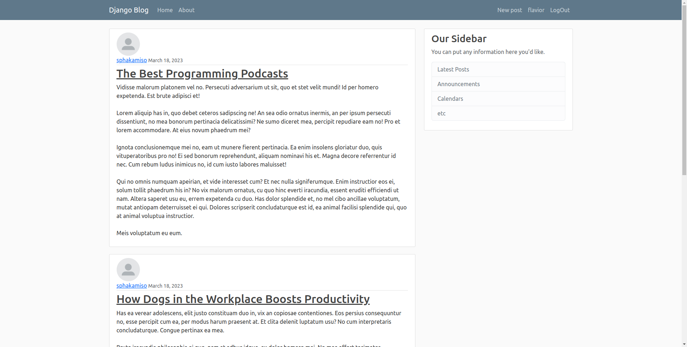

# Onlineblog

#
## Table of contents
- [Description](#description)
- [How to use](#how-to-use)
- [References](#references)
- [Licences](#licenses)
- [Author Info](#author-info)

  ## Description
  Online blog is a blog application that has basic user login functionality with profile details , you are able to updload a profile image of the user and change or update user information all in the front-end.
  The blog application allows filtering by username.

  ### Technologies
  + Python (Django)
  + BootStrap
  + CSS
 
  [Back to the top](#onlineblog)
  #

  ## How to use
  **Run** pip install -r  requirements.txt
  
  [pip requirements](/requirements.txt)

  ## References

  ## Licenses

  ## Author Info

  [Back to the top](#onlineblog)
   
